# PyBer Analysis Report

## Background and Results

### Purpose
The purpose of this project is to demonstrate the data visualization techniques in matplotlib.  As usual in this course, the weekly challenge builds upon the code that was developed throughout the modules for the subject matter in question.  

### Technical Analysis
The analysis begins with 2 csv files.  The first contains data of city names, number of drivers, and type of city.  The second contains city names, date & time, fare, and a ride ID.  These files are read into pandas dataframes and inspected to determine if there are any missing values by using the isnull function.  
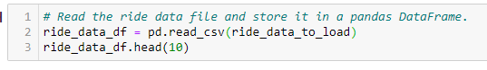
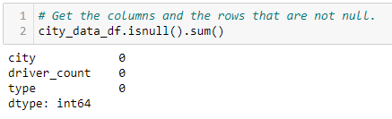

Once the datasets are inspected, they are combined with the pandas merge function.  
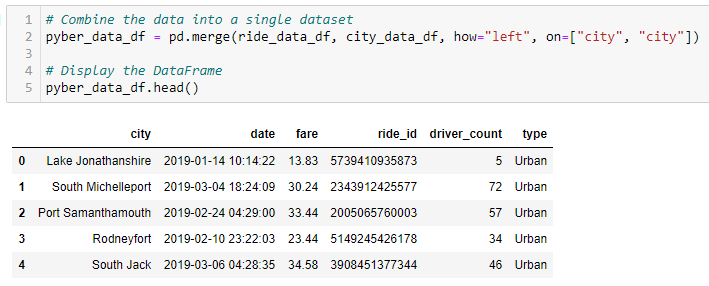

After the dataframes are merged, we can subset the data into additional dataframes and use the groupby function to gather counts and means that will be used as the x & y axes for scatter & bubble plots.  
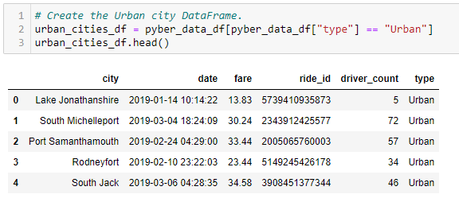
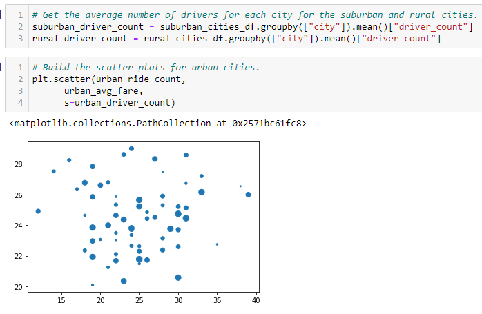

From here we begin to look at summary statistics and develop box and whisker charts.  These charts are helpful in visualizing central tendencies, spread, and outliers in one image.  Pie charts are developed to show percentages of total fares, number of rides, and number of drivers by city type.  A summary dataframe is built, formatted, and displayed.  Finally, a multi-line chart is developed by organizing the data using pandas pivot_table and resample functions to create weekly bins of data.  A great deal of formatting was done to create an attractive chart.  

### Results
Fig. 1:

Fig. 2:
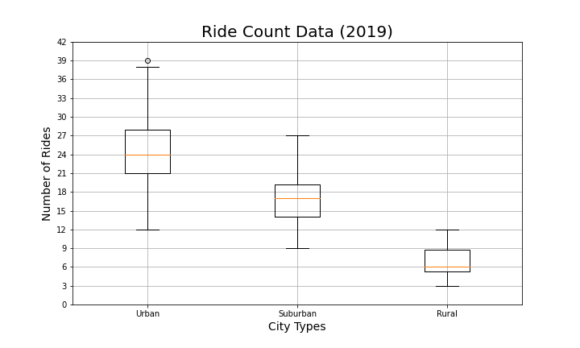
Fig. 3:
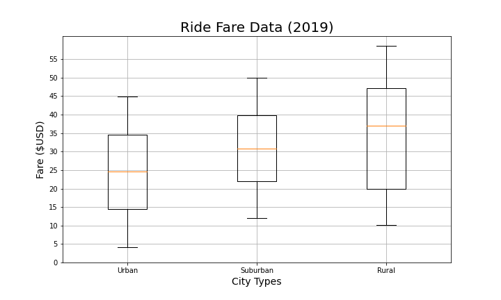
Fig. 4:
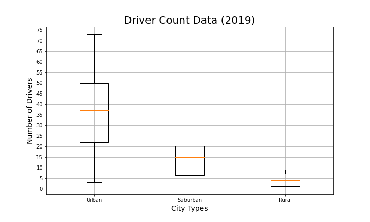
Fig. 5:
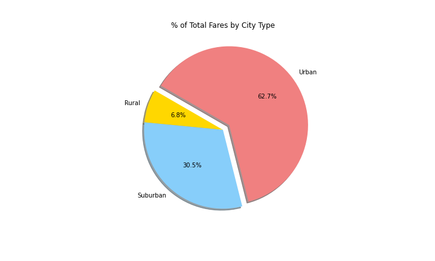
Fig. 6:
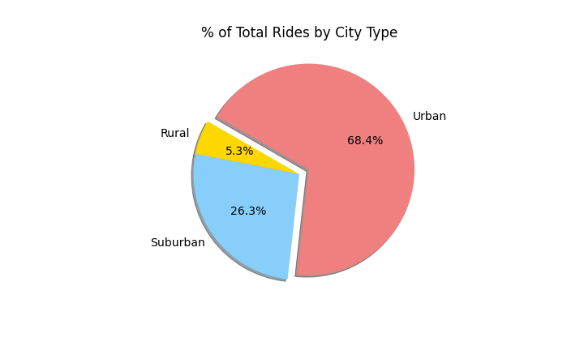
Fig. 7:
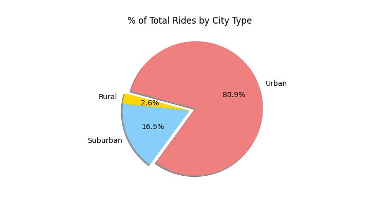
Fig. 8:
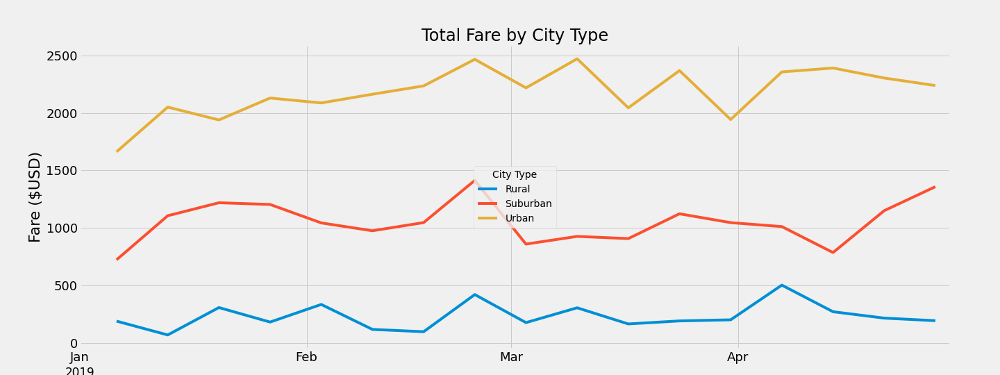

### Summary
As expected, there are fewer rides and fewer drivers in the rural and suburban areas as compared to the urban areas.  As shown in Fig. 9, As expected fares to increase as we move away from the urban areas since the rides in suburban and rural areas tend to cover greater distances.  
Fig. 9:
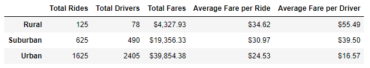

## Challenges Encountered and Overcome

### Challenges and Difficulties Encountered

* Programming:  One of the largest programming challenges for me was figuring out that I did not need to "unpack" the Date column from the index in order to change its datatype to datetime.  This was accomplished with the code below.
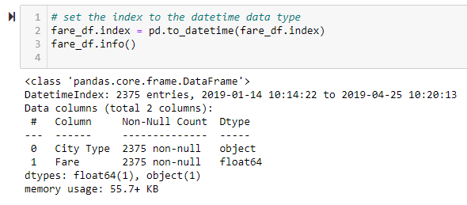

* Programming:  Another challenge was researching and discovering the pandas pivot_table function.  This was used to reconfigure the dataframe to set up the weekly bins that would be used for plotting the multi-line chart.
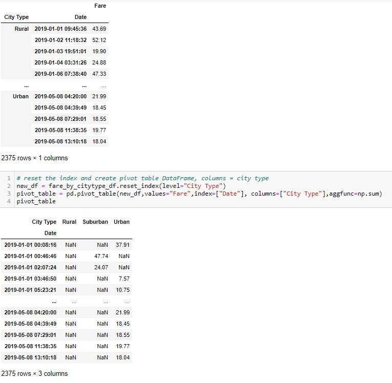

* Data analysis:  Once the datasets are merged, the number of drivers for each city is duplicated throughout the dataframe (i.e. each instance of a city will show the number of drivers).  To overcome this, we must use the city data dataframe to calculate the total number of drivers per city type.  If the programmer does not recognize this, there will be a large error in the results.

* Graphing, etc:  A lot of time was spent formatting the multi-line chart.  My largest challenge in this area was uncovering how to change the format of the timestamp x-axis labels to simply show the month abbreviation.  I discovered matplotlib.dates and, after reading some of the documentation, was able to use the DateFormatter to get the desired format.
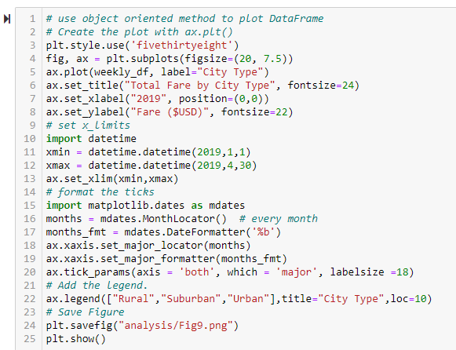

### Technical Analyses Used

## Recommendations and Next Steps

### Recommendations for Future Analysis

### Additional Analysis 1

* Description of Approach

* Technical Steps

### Additional Analysis 2

* Description of Approach

* Technical Steps
